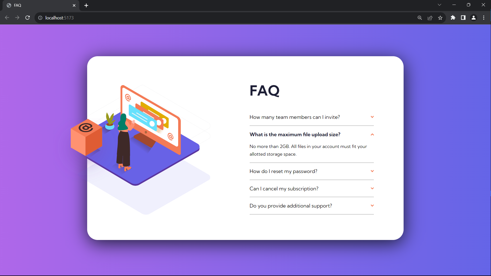

# Frontend Mentor - FAQ accordion card solution

This is a solution to the [FAQ accordion card challenge on Frontend Mentor](https://www.frontendmentor.io/challenges/faq-accordion-card-XlyjD0Oam). 

## Table of contents

- [Overview](#overview)
  - [The challenge](#the-challenge)
  - [Screenshot](#screenshot)
  - [Links](#links)
- [My process](#my-process)
  - [Built with](#built-with)
  - [What I learned](#what-i-learned)
  - [Useful resources](#useful-resources)
- [Author](#author)

## Overview

### The challenge

Users should be able to:

- View the optimal layout for the component depending on their device's screen size
- See hover states for all interactive elements on the page
- Hide/Show the answer to a question when the question is clicked

### Screenshot

### Links

- Solution URL: [Link](https://github.com/TJ-Shubham/FAQ-accordion-card)
- Live Site URL: [Link](https://tj-shubham.github.io/FAQ-accordion-card/)

## My process

### Built with

- [React]-18(https://reactjs.org/) & [Vite](https://vitejs.dev/guide/) - JS library
- CSS custom properties
- Flexbox
- Mobile-first workflow

### What I learned

Learn props, useState and conditional rendering

### Useful resources

- [React](https://react.dev/learn/describing-the-ui) - It is good documentation and easy to learn with hands of coding. Work more on this for some fun.
- [Clip-Path](https://css-tricks.com/almanac/properties/c/clip-path/) - Learn about clip-path property using polygon().

## Author

- Frontend Mentor - [TJ-Shubham](https://www.frontendmentor.io/profile/TJ-Shubham)

